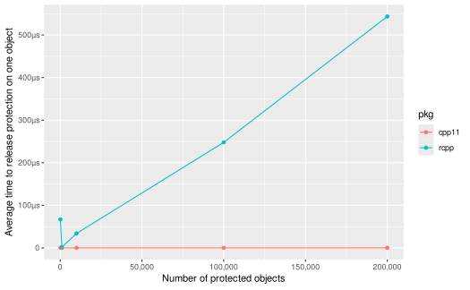

# Motivations for cpp11

## Motivations

R and S have a long history of interacting with compiled languages. In
fact the original version of S written in the late 1970s was mainly a
wrapper around FORTRAN routines
[(History-of-S)](https://www.r-project.org/conferences/useR-2006/Slides/Chambers.pdf).
Released in 2000, the [cxx](https://cran.r-project.org/package=cxx)
package was an early prototype of C++ bindings to R.
[Rcpp](https://cran.r-project.org/package=Rcpp) was first published to
CRAN in 2008, and [Rcpp11](https://cran.r-project.org/package=Rcpp11) in
2014. Of these `Rcpp` has by far the widest adoption, with over 2000
reverse dependencies as of 2020.

Rcpp has been a widely successful project, however over the years a
number of issues and additional C++ features have arisen. Adding these
features to Rcpp would require a great deal of work, or in some cases
would be impossible without severely breaking backwards compatibility.

cpp11 is a ground up rewrite of C++ bindings to R with different design
trade-offs and features.

Changes that motivated cpp11 include:

- Enforcing [copy-on-write semantics](#copy-on-write-semantics).
- Improving the [safety](#improve-safety) of using the R API from C++
  code.
- Supporting [ALTREP objects](#altrep-support).
- Using [UTF-8 strings](#utf-8-everywhere) everywhere.
- Applying newer [C++11 features](#c11-features).
- Having a more straightforward, [simpler
  implementation](#simpler-implementation).
- Faster [compilation time](#compilation-speed) with lower memory
  requirements.
- Being *completely* [header only](#header-only) to avoid ABI issues.
- Capable of [vendoring](#vendoring) if desired.
- More robust [protection](#protection) using a much more efficient
  linked list data structure.
- [Growing vectors](#growing-vectors) more efficiently.

### Copy-on-write semantics

R uses
[copy-on-write](https://adv-r.hadley.nz/names-values.html#copy-on-modify)
(also called copy-on-modify) semantics. Lets say you have two variables
`x` and `y` that both point to the same underlying data.

``` r
x <- c(1, 2, 3)
y <- x
```

If you modify `y`, R will first copy the values of `x` to a new
position, then point `y` to the new location and only after the copy
modify `y`. This allows `x` to retain the original values.

``` r
y[[3]] <- 4
y
#> [1] 1 2 4

x
#> [1] 1 2 3
```

C++ does not have copy-on-write built into the language, however it has
related concepts, copy-by-value and copy-by-reference. Copy-by-value
works similarly to R, except that R only copies when something is
changed, C++ *always* copies.

``` cpp
int x = 42;
int y = x;
y = 0;
// x is still == 42
```

Copy-by-reference does the opposite, both `x` and `y` always point to
the *same* underlying value. In C++ you specify a reference with `&`.

``` cpp
int x = 42;
int &y = x;
y = 0;
// both x and y are now 0
```

Copy-by-reference is a valuable technique, as it avoids the overhead of
copying the data. However it can also lead to errors when internal
functions change their inputs unexpectedly. Rcpp uses copy-by-reference
by default (even if you pass a Rcpp vector class by value). This gives
Rcpp functions completely different semantics from normal R functions.

We can illustrate this by creating a Rcpp function that multiples its
input vector by 2.

``` cpp
#include "Rcpp.h"
using namespace Rcpp;

// [[Rcpp::export]]
NumericVector times_two_rcpp(NumericVector x) {
  for (int i = 0; i < x.size(); ++i) {
    x[i] = x[i] * 2;
  }
  return x;
}
```

If you do this with regular R functions, you will see the value of `y`
is `x` \* 2, but the value of `x` is unchanged.

``` r
x <- c(1, 2, 3)
y <- x * 2
y
#> [1] 2 4 6

x
#> [1] 1 2 3
```

However if we now call our `times_two_rcpp()` function we get the right
output value, but now `x` is *also changed*.

``` r
z <- times_two_rcpp(x)
z
#> [1] 2 4 6

x
#> [1] 2 4 6
```

cpp11 strives to make its functions behave similarly to normal R
functions, while preserving the speed of Rcpp when read only access is
needed. Each of the r_vector classes in cpp11 has a normal *read only*
version that uses copy-by-reference, and a *writable* version which uses
copy-by-value.

``` cpp
#include "cpp11/doubles.hpp"

[[cpp11::register]]
cpp11::doubles times_two_cpp11(cpp11::writable::doubles x) {
  for (int i = 0; i < x.size(); ++i) {
    x[i] = x[i] * 2;
  }
  return x;
}
```

Using `cpp11::writable::doubles` first *copies* the input vector, so
when we do the multiplication we do not modify the original data.

``` r
x <- c(1, 2, 3)

z <- times_two_cpp11(x)
z
#> [1] 2 4 6

x
#> [1] 1 2 3
```

### Improve safety

Internally R is written in C, not C++. In general C and C++ work well
together, a large part of C++’s success is due to its high
interoperability with C code. However one area in which C and C++ are
generally *not* interoperable is error handling. In C++ the most common
way to handle errors is with
[exceptions](https://isocpp.org/wiki/faq/exceptions).

Exceptions provide a clean, safe way for objects to obtain and cleanup
resources automatically even when errors occur.

#### C safety

The C language does not have support for exceptions, so error handling
is done a variety of ways. These include error codes like
[errno](https://en.cppreference.com/w/c/error/errno), conditional
statements, and in the R codebase the
[longjmp](https://cplusplus.com/reference/csetjmp/longjmp/) function.

`longjmp`, which stands for ‘long jump’ is a function that allows you to
transfer the control flow of a program to another location elsewhere in
the program. R uses long jumps extensively in its error handling
routines. If an R function is executing and an error occurs, a long jump
is called which ‘jumps’ the control flow into the error handling code.

Crucially long jumps are *incompatible* with C++
[destructors](https://isocpp.org/wiki/faq/dtors). If a long jump occurs
the destructors of any active C++ objects are not run, and therefore any
resources (such as memory, file handles, etc.) managed by those objects
will cause a [resource
leak](https://en.wikipedia.org/wiki/Resource_leak).

For example, the following unsafe code would leak the memory allocated
in the C++ `std::vector` `x` when the R API function `Rf_allocVector()`
fails (since you can’t create a vector of `-1` size).

``` cpp
std::vector<double> x({1., 2., 3.});

SEXP y = PROTECT(Rf_allocVector(REALSXP, -1));
```

cpp11 provides two mechanisms to make interfacing with Rs C API and C++
code safer. `cpp11::unwind_protect()` takes a functional object (a C++11
lamdba function or `std::function`) and converts any C long jumps
encountered to C++ exceptions. Now instead of a C long jump happening
when the `Rf_allocVector()` call fails, a C++ exception occurs, which
*does* trigger the `std::vector` destructor, so that memory is
automatically released.

``` cpp
std::vector<double> x({1., 2., 3.});

SEXP y;
unwind_protect([]() {
  y = Rf_allocVector(REALSXP, -1);
})
```

`cpp11::safe()` is a more concise way to wrap a particular R API
function with `unwind_protect()`.

``` cpp
std::vector<double> x({1., 2., 3.});

SEXP y = PROTECT(safe[Rf_allocVector](REALSXP, -1));
```

Again using `cpp11::safe()` converts the C long jump to a C++ exception,
so the memory is automatically released.

cpp11 uses these mechanisms extensively internally when calling the R C
API, which make cpp11 much safer against resource leaks than using Rcpp
or calling Rs C API by hand.

#### C++ safety

In the inverse of C safety we also need to ensure that C++ exceptions do
not reach the C call stack, as they will terminate R if that occurs.
Like Rcpp, cpp11 automatically generates `try / catch` guards around
registered functions to prevent this and also converts C++ exceptions
into normal R errors. This is done without developer facing code
changes.

With both C and C++ sides of the coin covered we can safely use R’s C
API and C++ code together with C++ objects without leaking resources.

### Altrep support

[ALTREP](https://svn.r-project.org/R/branches/ALTREP/ALTREP.html) which
stands for **ALT**ernative **REP**resntations is a feature introduced in
R 3.5. ALTREP allows R internals and package authors to define
alternative ways of representing data to R. One example of the use of
altrep is the `:` operator.

Prior to R 3.5 `:` generated a full vector for the entire sequence.
e.g. `1:1000` would require 1000 individual values. As of R 3.5 this
sequence is instead represented by an ALTREP vector, so *none* of the
values actually exist in memory. Instead each time R access a particular
value in the sequence that value is computed on-the-fly. This saves
memory and excution time, and allows users to use sequences which would
otherwise be too big to fit in memory.

``` r
1:1e9
#>  [1]  1  2  3  4  5  6  7  8  9 10 11 12 13 14 15 16 17 18 19 20
#>  [ reached 'max' / getOption("max.print") -- omitted 999999980 entries ]
```

Because Rcpp predates the introduction of ALTREP, it does not support
the interfaces needed to access ALTREP objects. This means the objects
must be converted to normal R objects as soon as they are used by Rcpp.

``` cpp
#include "Rcpp.h"

// [[Rcpp::export]]
Rcpp::IntegerVector identity_rcpp(Rcpp::IntegerVector x) {
  return x;
}
```

``` r
x <- identity_rcpp(1:100000)
lobstr::obj_size(x)
#> 400.73 kB
```

Whereas cpp11 objects preserve the ALTREP object.

``` cpp
#include "cpp11/integers.hpp"

[[cpp11::register]]
cpp11::integers identity_cpp11(cpp11::integers x) {
  return x;
}
```

``` r
y <- identity_cpp11(1:100000)
lobstr::obj_size(y)
#> 680 B
```

#### Altrep benchmarks

In these benchmarks note that Rcpp allocates memory for the ALTREP
vectors. This is because Rcpp implicitly converts them into normal R
vectors. cpp11 retains them as ALTREP vectors, so no additional memory
is needed.

`foreach` and `accumulate` both use iterators that take advantage of
`REAL_GET_REGION` to buffer queries. This makes them faster than naive
C-style for loops with ALTREP vectors.

The for2 case shows an optimization you can use if you know at
compile-time that you won’t be dealing with ALTREP vectors. By
specifying `false` to the second argument (`is_altrep`), you can disable
the ALTREP support. This causes the ALTREP conditional code to be
compiled out resulting in loop unrolling (and speeds) identical to that
generated by Rcpp.

``` r
library(cpp11test)

cases <- expand.grid(
  len = 3e6,
  vector = c("normal", "altrep"),
  method = c("for", "foreach", "accumulate"),
  pkg = c("cpp11", "rcpp"),
  stringsAsFactors = FALSE
)

# Add special case
cases <- rbind(list(len = 3e6, vector = "normal", method = "for2", pkg = "cpp11"), cases)

b_sum <- bench::press(
  .grid = cases,
  {
    seq_real <- function(x) as.numeric(seq_len(x))
    funs <- c("normal" = rnorm, "altrep" = seq_real)
    x <- funs[[vector]](len)
    fun <- match.fun(sprintf("%ssum_dbl_%s_", ifelse(pkg == "cpp11", "", paste0(pkg, "_")), method))
    bench::mark(
      fun(x)
    )
  }
)[c("pkg", "method", "vector", "min", "median", "mem_alloc", "itr/sec", "n_gc")]

saveRDS(b_sum, "sum.Rds", version = 2)
```

``` r
knitr::kable(readRDS("sum.Rds"))
```

| pkg   | method     | vector |         min |      median | mem_alloc |  itr/sec | n_gc |
|:------|:-----------|:-------|------------:|------------:|----------:|---------:|-----:|
| cpp11 | for2       | normal | 0.003008334 | 0.003208736 |         0 | 302.9364 |    0 |
| cpp11 | for        | normal | 0.002929285 | 0.003088721 |         0 | 319.9100 |    0 |
| cpp11 | for        | altrep | 0.008089832 | 0.008442934 |         0 | 117.0562 |    0 |
| cpp11 | foreach    | normal | 0.002966348 | 0.003361415 |         0 | 292.8306 |    0 |
| cpp11 | foreach    | altrep | 0.004017410 | 0.004184819 |         0 | 236.2339 |    0 |
| cpp11 | accumulate | normal | 0.003033590 | 0.003241419 |         0 | 303.3408 |    0 |
| cpp11 | accumulate | altrep | 0.004067195 | 0.004311647 |         0 | 225.8066 |    0 |
| rcpp  | for        | normal | 0.002807784 | 0.003127156 |         0 | 311.3724 |    0 |
| rcpp  | for        | altrep | 0.002805196 | 0.003131571 |  24000048 | 311.6365 |    0 |
| rcpp  | foreach    | normal | 0.002928401 | 0.003462064 |         0 | 293.9831 |    0 |
| rcpp  | foreach    | altrep | 0.002810107 | 0.003068041 |  24000048 | 313.6250 |    0 |
| rcpp  | accumulate | normal | 0.002803584 | 0.003006378 |         0 | 321.6647 |    0 |
| rcpp  | accumulate | altrep | 0.002750792 | 0.003000370 |  24000048 | 322.9292 |    0 |

[cpp11test/src/sum.cpp](https://github.com/r-lib/cpp11/blob/main/cpp11test/src/sum.cpp)
contains the code ran in these benchmarks.

### UTF-8 everywhere

R has complicated support for Unicode strings and non-ASCII code pages,
whose behavior often differs substantially on different operating
systems, particularly Windows. Correctly dealing with this is
challenging and often feels like whack a mole.

To combat this complexity cpp11 uses the [UTF-8
everywhere](http://utf8everywhere.org/) philosophy. This means that
whenever text data is converted from R data structures to C++ data
structures by cpp11 the data is translated into UTF-8. Conversely any
text data coming from C++ code is assumed to be UTF-8 and marked as such
for R. Doing this universally avoids many locale specific issues when
dealing with Unicode text.

Concretely cpp11 always uses `Rf_translateCharUTF8()` when obtaining
`const char*` from `CHRSXP` objects and uses `Rf_mkCharCE(, CE_UTF8)`
when creating new `CHRSXP` objects from `const char*` inputs.

### C++11 features

C++11 provides a host of new features to the C++ language. cpp11 uses a
number of these including

- [move
  semantics](https://en.cppreference.com/w/cpp/language/move_constructor)
- [type traits](https://en.cppreference.com/w/cpp/header/type_traits)
- [initializer_list](https://en.cppreference.com/w/cpp/utility/initializer_list)
- [variadic templates / parameter
  packs](https://en.cppreference.com/w/cpp/language/parameter_pack)
- [user defined
  literals](https://en.cppreference.com/w/cpp/language/user_literal)
- [user defined
  attributes](https://en.cppreference.com/w/cpp/language/attributes)

### Simpler implementation

Rcpp is very ambitious, with a number of advanced features, including
[modules](https://cran.r-project.org/package=Rcpp/vignettes/Rcpp-modules.pdf),
[sugar](https://cran.r-project.org/package=Rcpp/vignettes/Rcpp-sugar.pdf)
and extensive support for
[attributes](https://CRAN.R-project.org/package=Rcpp/vignettes/Rcpp-attributes.pdf).
While these are useful features, many R packages do not use one or any
of these advanced features. In addition the code needed to support these
features is complex and can be challenging to maintain.

cpp11 takes a more limited scope, providing only the set of r_vector
wrappers for R vector types, coercion methods to and from C++ and the
limited attributes necessary to support use in R packages.

This limited scope allows the implementation to be much simpler, the
headers in Rcpp 1.0.4 have 74,658 lines of code (excluding blank or
commented lines) in 379 files. Some headers in Rcpp are automatically
generated, removing these still gives you 25,249 lines of code in 357
files. In contrast the headers in cpp11 contain only 1,734 lines of code
in 19 files.

This reduction in complexity should make cpp11 an easier project to
maintain and ensure correctness, particularly around interactions with
the R garbage collector.

### Compilation speed

Rcpp always bundles all of its headers together, which causes slow
compilation times and high peak memory usage when compiling. The headers
in cpp11 are more easily decoupled, so you only can include only the
particular headers you actually use in a source file. This can
significantly improve the compilation speed and memory usage to compile
your package.

Here are some real examples of the reduction in compile time and peak
memory usage after converting packages to cpp11.

| package  | Rcpp compile time | cpp11 compile time | Rcpp peak memory | cpp11 peak memory | Rcpp commit                                                                | cpp11 commit                                                               |
|----------|-------------------|--------------------|------------------|-------------------|----------------------------------------------------------------------------|----------------------------------------------------------------------------|
| haven    | 17.42s            | 7.13s              | 428MB            | 204MB             | [a3cf75a4](https://github.com/tidyverse/haven/compare/a3cf75a4...978cb034) | [978cb034](https://github.com/tidyverse/haven/compare/a3cf75a4...978cb034) |
| readr    | 124.13s           | 81.08s             | 969MB            | 684MB             | [ec0d8989](https://github.com/tidyverse/readr/compare/ec0d8989...aa89ff72) | [aa89ff72](https://github.com/tidyverse/readr/compare/ec0d8989...aa89ff72) |
| roxygen2 | 17.34s            | 4.24s              | 371MB            | 109MB             | [6f081b75](https://github.com/r-lib/roxygen2/compare/6f081b75...e8e1e22d)  | [e8e1e22d](https://github.com/r-lib/roxygen2/compare/6f081b75...e8e1e22d)  |
| tidyr    | 14.25s            | 3.34s              | 363MB            | 83MB              | [3899ed51](https://github.com/tidyverse/tidyr/compare/3899ed51...60f7c7d4) | [60f7c7d4](https://github.com/tidyverse/tidyr/compare/3899ed51...60f7c7d4) |

### Header only

Rcpp has long been a *mostly* [header
only](https://en.wikipedia.org/wiki/Header-only) library, however is not
a *completely* header only library. There have been
[cases](https://github.com/tidyverse/dplyr/issues/2308) when a package
was first installed with version X of Rcpp, and then a newer version of
Rcpp was later installed. Then when the original package X was loaded R
would crash, because the [Application Binary
Interface](https://en.wikipedia.org/wiki/Application_binary_interface)
of Rcpp had changed between the two versions.

Because cpp11 consists of exclusively headers this issue does not occur.

### Vendoring

In the go community the concept of
[vendoring](https://go.googlesource.com/proposal/+/master/design/25719-go15vendor.md)
is widespread. Vendoring means that you copy the code for the
dependencies into your project’s source tree. This ensures the
dependency code is fixed and stable until it is updated. Because cpp11
is fully [header only](#header-only) you can vendor the code in the same
way. `cpp11::vendor_cpp11()` is provided to do this if you choose.

Vendoring has advantages and drawbacks however. The advantage is that
changes to the cpp11 project could never break your existing code. The
drawbacks are both minor, your package size is now slightly larger, and
major, you no longer get bugfixes and new features until you explicitly
update cpp11.

I think the majority of packages should use `LinkingTo: cpp11` and *not*
vendor the cpp11 dependency. However, vendoring can be appropriate for
certain situations.

### Protection

cpp11 uses a custom double linked list data structure to track objects
it is managing. This structure is much more efficient for large numbers
of objects than using `R_PreserveObject()` / `R_ReleaseObjects()` as is
done in Rcpp.

``` r
library(cpp11test)
grid <- expand.grid(len = c(10 ^ (2:5), 2e5), pkg = c("cpp11", "rcpp"), stringsAsFactors = FALSE)
b_release <- bench::press(.grid = grid,
  {
    fun = match.fun(sprintf("%s_release_", pkg))
    bench::mark(
      fun(len),
      iterations = 1
    )
  }
)[c("len", "pkg", "min")]
saveRDS(b_release, "release.Rds", version = 2)
```

    #> Ignoring unknown labels:
    #> • tite : "cpp11 uses constant time protection"



This plot shows the average time to protect and release a given object
is essentially constant for cpp11. Whereas it is linear or worse with
the number of objects being tracked for Rcpp.

|   len | pkg   |      min |
|------:|:------|---------:|
| 1e+02 | cpp11 |  26.28µs |
| 1e+03 | cpp11 | 127.51µs |
| 1e+04 | cpp11 |   1.36ms |
| 1e+05 | cpp11 |  14.89ms |
| 2e+05 | cpp11 |  35.62ms |
| 1e+02 | rcpp  |    6.7ms |
| 1e+03 | rcpp  |   1.62ms |
| 1e+04 | rcpp  | 340.38ms |
| 1e+05 | rcpp  |   24.79s |
| 2e+05 | rcpp  |    1.81m |

### Growing vectors

One major difference in Rcpp and cpp11 is how vectors are grown. Rcpp
vectors have a `push_back()` method, but unlike `std::vector()` no
additional space is reserved when pushing. This makes calling
`push_back()` repeatably very expensive, as the entire vector has to be
copied each call.

In contrast `cpp11` vectors grow efficiently, reserving extra space.
Because of this you can do ~10,000,000 vector appends with cpp11 in
approximately the same amount of time that Rcpp does 10,000, as this
benchmark demonstrates.

``` r
grid <- expand.grid(len = 10 ^ (0:7), pkg = "cpp11", stringsAsFactors = FALSE)
grid <- rbind(
  grid,
  expand.grid(len = 10 ^ (0:4), pkg = "rcpp", stringsAsFactors = FALSE)
)
b_grow <- bench::press(.grid = grid,
  {
    fun = match.fun(sprintf("%sgrow_", ifelse(pkg == "cpp11", "", paste0(pkg, "_"))))
    bench::mark(
      fun(len),
      min_iterations = 100
    )
  }
)[c("len", "pkg", "min", "mem_alloc", "n_itr", "n_gc")]
saveRDS(b_grow, "growth.Rds", version = 2)
```


|   len | pkg   |      min | mem_alloc | n_itr | n_gc |
|------:|:------|---------:|----------:|------:|-----:|
| 1e+00 | cpp11 |    3.3µs |        0B | 10000 |    0 |
| 1e+01 | cpp11 |   6.05µs |        0B |  9999 |    1 |
| 1e+02 | cpp11 |   8.49µs |    1.89KB | 10000 |    0 |
| 1e+03 | cpp11 |  14.18µs |   16.03KB |  9999 |    1 |
| 1e+04 | cpp11 |  63.77µs |  256.22KB |  3477 |    2 |
| 1e+05 | cpp11 | 443.32µs |       2MB |   404 |    5 |
| 1e+06 | cpp11 |   3.99ms |      16MB |    70 |    3 |
| 1e+07 | cpp11 | 105.51ms |     256MB |     1 |    5 |
| 1e+00 | rcpp  |   2.64µs |        0B | 10000 |    0 |
| 1e+01 | rcpp  |   3.13µs |        0B |  9999 |    1 |
| 1e+02 | rcpp  |  13.87µs |   42.33KB |  9997 |    3 |
| 1e+03 | rcpp  | 440.77µs |    3.86MB |   319 |    1 |
| 1e+04 | rcpp  |  54.13ms |  381.96MB |     2 |    2 |

### Conclusion

Rcpp has been and will continue to be widely successful. cpp11 is a
alternative implementation of C++ bindings to R that chooses different
design trade-offs and features. Both packages can co-exist (even be used
in the same package!) and continue to enrich the R community.
